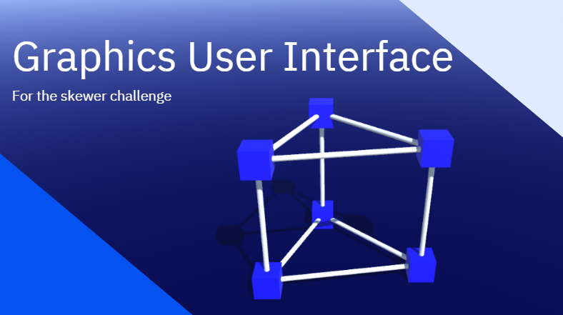
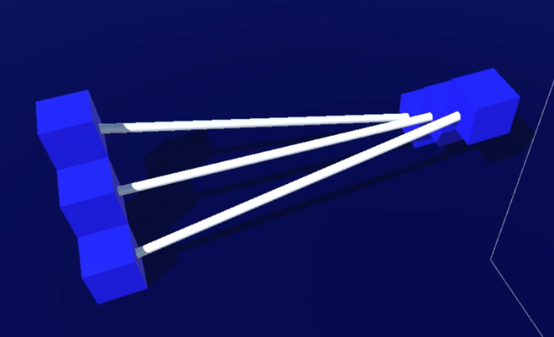
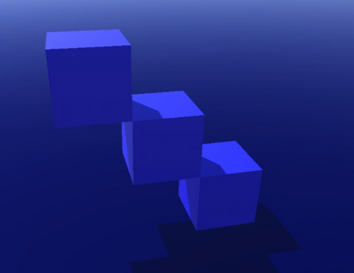
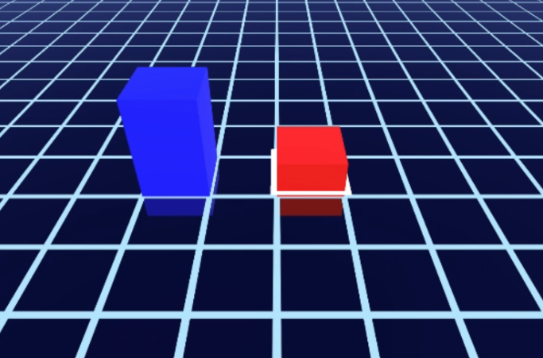
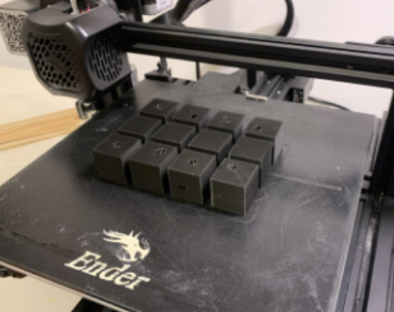

# Skewers-Joints-Structure-Builder
GUI for the skewer challenge

The challenge has been described here : https://docs.google.com/document/d/1Lblimi5BUa55nwcqNMm2k7uojzsza2ff15a76sxHsxA/edit?usp=sharing

The project aims to write a program that allows for designing structures described in the challenge and offers the generation of simple cube-based connectors for 3D printing.

Group : BOGDANOVIC William - TRABBIA Joffrey

------------------------------

------------------------------
Here is an image of several joints and skewers linked bewteen them.

------------------------------
Here are some joints, and the grid system, meant to limit the position of the joints (cubes), for easier manipulation of the interface by the user.

------------------------------
After creating their structure, the user is able to export the meshes of the joints (the cubes), using a script that returns an .STL file, instantly readable and printable by a 3D printer.

Thanks to this Unity package https://github.com/karl-/pb_CSG
Which let us create new meshes from the boolean operations of two 3D gameObjects.
